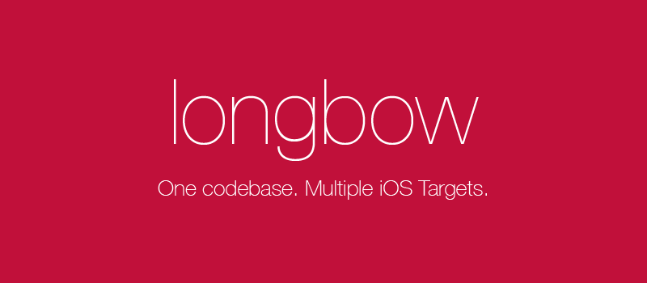

**Problem**

One codebase. Multiple App Store submission targets with different icons, launch images, info.plist keys, screenshots, etc.

**Solution**

```
$ longbow install
$ longbow shoot
$ longbow aim
```

**About**

Longbow is a command-line run ruby gem that duplicates the main target in your `.xcworkspace` or `.xcodeproj` file, then reads from a JSON file to fill out the rest of your new target. It looks for certain keys and does things like taking an icon image and resizing it for the various icons you'll need, and adding keys to the info.plist file for that target. The goal was to be practically autonomous in creating new targets and apps.

Additionally, it can create screenshots for each target app store submission. You write a simple UIAutomation script (it's just JavaScript) and Longbow takes care of taking the screenshots for each combination of target, device, and language.

**Requirements**

Longbow requires Xcode 5+, and your app must use the new .xcassets paradigm for icons, launch screens, etc.

## Table of Contents

* [Installation](#installation)
* [Set Up](#set-up)
* [Formatting longbow.json](#formatting-longbow-json)
* [Create a Target](#create-a-target)
* [Global Options](#global-options)
* [The Future](#the-future)
* [Contributing](#contributing)

## Installation

Longbow is officially hosted on [RubyGems](http://rubygems.org/gems/longbow), so installation is a breeze:

    $ gem install longbow

## Set Up

Run `longbow install` in the directory where your `.xcworkspace` or `.xcodeproj` file lives. This will create a file, `longbow.json`, where they will be used to build out from here. You are almost ready to start creating new targets

## Formatting longbow.json

Here's a basic gist of how to format your `longbow.json` file:

```json
{
	"targets":[
		{
			"name":"TargetName",
			"icon_url":"https://somewhere.net/img.png",
			"launch_phone_p_url":"https://somewhere.net/img2.png",
			"info_plist": {
        		"CFBundleIdentifier":"com.company.target1",
            	"ProprietaryKey":"Value"
      		}
		},
		{
			"name":"TargetName2",
			"icon_path":"/relative/path/to/file.png",
			"launch_phone_p_path":"/relative/path/to/file2.png",
			"info_plist": {
        		"CFBundleIdentifier":"com.company.target2",
            	"ProprietaryKey":"Value2"
      		}
		}
	],
 	"global_info_keys":{
 		"somekey":"somevalue"
 	},
    "devices":["iPhone","iPad"]
}
```

In the top-level of the JSON file, we have 3 key/value pairs:

* `targets`
* `devices`
* `global_info_keys`

The `targets` section contains nested key/value pairs for each specific target. Devices holds an array of "iPhone" and/or "iPad". "global_info_keys" contains key/value pairs that you'd like to add to the info.plist file for all targets in this JSON file. Each target can contain the following keys:

* `icon_url` or `icon_path`
* `launch_phone_p_url` or `launch_phone_p_path`
* `launch_phone_l_url` or `launch_phone_l_path`
* `launch_tablet_p_url` or `launch_tablet_p_path`
* `launch_tablet_l_url` or `launch_tablet_l_path`
* `info_plist`
* `name`

The `icon_url` and `icon_path` key corresponds to the location of the icon image. It will be downloaded from the web if necessary, then resized depending on your device setting and added to the Images.xcassets file for that target. The same goes for the launch image keys. The p and l parts correspond to portrait and landscape orientation. The `info_plist` key corresponds to another set of key/value pairs that will be added or updated in the info.plist file specifically for this target.

**Note:** `info_plist` takes precedence over `global_info_keys` for two of the same keys in both places.

## Creating/Updating a Target

Now that you're set up - it's time to add a target. Make sure that you have updated your `longbow.json` file with the correct information for your target, and then run the following command inside the project directory.

`longbow shoot -n NameOfTarget`

What this does is goes to your `longbow.json` file and looks for the correct target dictionary, and tries to create a new Target in your app. It then handles the various icons/info_plist additions specifically for this target. If your target already exists, it will just update the icon images and plist settings.

If you leave off the `-n` option, it will run for all targets in the `longbow.json` file.

**Other Options**

* `-d, --directory` - if not in the current directory, specify a new path
* `-u, --url` - the url of a longbow formatted JSON file

`longbow shoot -n NameOfTarget -d ~/Path/To/App -u http://someurl.com/longbow.json`

## Global Options

`--dontlog` will not log the status/operations to the console.

`--help` will fill you in on what you need to do for an action.

## Taking Screenshots

So you've created all your targets and finished the first version of the app - now you need the screen shots to submit it to the App Store.

First you'll need to write a single UIAutomation script to take the screenshots. You can see [Apple's Documentation](https://developer.apple.com/library/ios/documentation/DeveloperTools/Reference/UIAutomationRef/_index.html) for more information on writing the script. The part we're primarily concerned with is the captureLocalizedScreenshot() method provided by Longbow. This method will take the screenshot with a consistent naming scheme and place it in a folder for each target.

`captureLocalizedScreenshot("homeScreen");` will create ~/Desktop/screenshots/TargetName/en-US/iOS-4-in\_\_\_portrait\_\_\_homeScreen.png

Once you've created your automation script, you can run it by calling `longbow aim`. This command will generate a variation of your UIAutomation script for each target, then handle running it for each target. Grab a drink, depending on your script and your number of targets, this may take a while.

**Options**

Similar to the `shoot` command, there are flags you can use with this feature.

* `-n` - name of the target to capture
* `-d` - directory the project lives in
* `-u` - url of the longbow.json file

## The Future

* Unit Tests
* App Store deployment of Targets

## Contributing

1. Fork it
2. Create your feature branch (`git checkout -b my-new-feature`)
3. Commit your changes (`git commit -am 'Add some feature'`)
4. Push to the branch (`git push origin my-new-feature`)
5. Create new Pull Request
